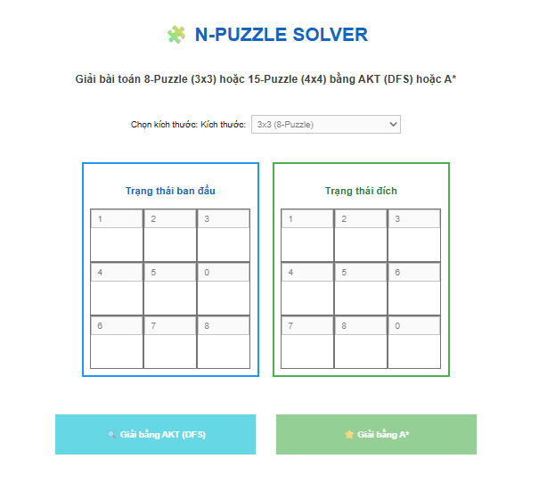
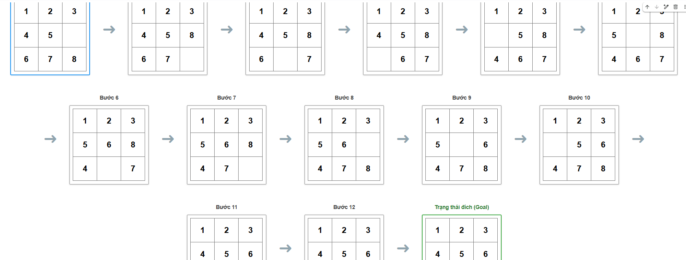

Dự án này triển khai một ứng dụng Python tương tác để giải bài toán N-Puzzle (ví dụ: 8-Puzzle, 15-Puzzle) bằng cách sử dụng các thuật toán tìm kiếm phổ biến. N-Puzzle là một trò chơi xếp hình trượt bao gồm một khung gạch vuông được đánh số theo thứ tự ngẫu nhiên, với một ô trống. Mục tiêu là sắp xếp lại các viên gạch theo thứ tự tăng dần (hoặc một cấu hình đích cụ thể) bằng cách trượt các viên gạch vào ô trống.

## Các thuật toán được triển khai
Ứng dụng hỗ trợ giải N-Puzzle bằng hai thuật toán chính:

1.  **Tìm kiếm theo chiều sâu (AKT/DFS)**: Một thuật toán tìm kiếm không có thông tin, khám phá sâu nhất có thể dọc theo mỗi nhánh trước khi quay lui.
2.  **A* Search (A*)**: Một thuật toán tìm kiếm có thông tin, sử dụng hàm heuristic (Manhattan Distance) để ước tính chi phí từ trạng thái hiện tại đến trạng thái đích, giúp tìm kiếm đường đi tối ưu hiệu quả hơn.

## Tính năng chính
*   **Giao diện tương tác (IPywidgets)**: Cho phép người dùng dễ dàng nhập trạng thái ban đầu và trạng thái đích của bảng N-Puzzle.
*   **Hỗ trợ đa kích thước**: Có thể giải các bài toán 8-Puzzle (3x3) và 15-Puzzle (4x4).
*   **Hiển thị các bước giải**: Sau khi tìm thấy lời giải, ứng dụng sẽ hiển thị trực quan từng bước di chuyển từ trạng thái ban đầu đến trạng thái đích, giúp người dùng dễ dàng theo dõi quá trình giải.
*   **Kiểm tra tính hợp lệ**: Tự động kiểm tra tính hợp lệ của trạng thái đầu vào (ví dụ: các số từ 0 đến N-1, mỗi số xuất hiện một lần).
*   **Thông báo lỗi chi tiết**: Cung cấp thông báo rõ ràng khi trạng thái không hợp lệ hoặc khi không tìm thấy lời giải.

## Cách sử dụng
1.  Chạy các ô mã trong notebook Colab theo thứ tự.
2.  Chọn kích thước bảng N-Puzzle (3x3 hoặc 4x4).
3.  Nhập trạng thái ban đầu và trạng thái đích mong muốn vào các ô input tương ứng. Đảm bảo các số từ 0 đến `kích thước^2 - 1` được sử dụng chính xác, với 0 là ô trống.
4.  Nhấn nút **"Giải bằng AKT (DFS)"** hoặc **"Giải bằng A*"** để bắt đầu quá trình tìm kiếm lời giải.
5.  Kết quả (bao gồm các bước giải) sẽ được hiển thị bên dưới các nút.

## Cấu trúc dự án
*   `core_solver.py`: Chứa các lớp cơ sở `PuzzleSolver` và triển khai các thuật toán `AKT` (DFS) và `AStar`.
*   `helper_widgets.py`: Chứa các hàm hỗ trợ tạo và hiển thị giao diện người dùng tương tác bằng `ipywidgets` và chuyển đổi trạng thái bảng thành HTML.
*   `main.py`: Tệp chính điều phối logic ứng dụng, xử lý đầu vào người dùng, gọi các thuật toán giải và hiển thị kết quả.

## Kết quả 

