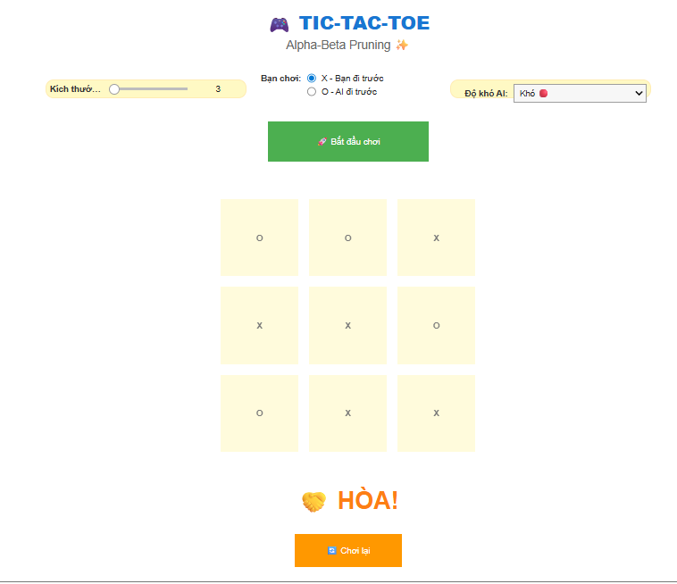

```markdown
# 🎮 Tic-Tac-Toe NxN với AI sử dụng Alpha-Beta Pruning

Đây là một dự án triển khai trò chơi Tic-Tac-Toe có thể chơi trên bảng kích thước N x N (từ 3x3 đến 5x5), với một đối thủ AI sử dụng thuật toán tìm kiếm **Alpha-Beta Pruning** kết hợp **Heuristic Evaluation** để đưa ra quyết định thông minh.

## ✨ Tính năng

*   **Kích thước bảng linh hoạt:** Người chơi có thể chọn kích thước bảng từ 3x3 đến 5x5.
*   **Chơi với AI:** Đối đầu với máy tính.
*   **Ba cấp độ khó của AI:**
    *   **Dễ:** AI chọn nước đi ngẫu nhiên.
    *   **Trung bình:** AI sử dụng thuật toán Alpha-Beta Pruning với giới hạn độ sâu (depth limit) là 4, cùng với hàm heuristic.
    *   **Khó:** AI sử dụng thuật toán Alpha-Beta Pruning với giới hạn độ sâu là 6 (hoặc 4 đối với bảng lớn hơn 4x4 để cân bằng hiệu suất), cùng với hàm heuristic nâng cao.
*   **Giao diện trực quan:** Giao diện người dùng được xây dựng bằng `ipywidgets` trong môi trường Google Colab/Jupyter Notebook.
*   **Tùy chọn người chơi:** Người chơi có thể chọn là X hoặc O, và quyết định ai đi trước.

## 🧠 AI (Alpha-Beta Pruning với Heuristic)

AI trong trò chơi này được thiết kế để chơi một cách chiến lược, đặc biệt ở các cấp độ khó hơn:

*   **Alpha-Beta Pruning:** Một thuật toán tìm kiếm giúp AI xem xét các nước đi có thể trong tương lai, cắt bỏ các nhánh tìm kiếm không cần thiết để tăng tốc độ và hiệu quả. Điều này cho phép AI đánh giá hàng triệu khả năng để tìm ra nước đi tốt nhất.
*   **Giới hạn độ sâu (Depth Limiting):** Để tránh tính toán quá lâu trên các bảng lớn hoặc độ khó cao, thuật toán tìm kiếm được giới hạn số lượng nước đi mà AI sẽ nhìn trước.
*   **Hàm Heuristic Evaluation:** Khi đạt đến giới hạn độ sâu hoặc trong các trạng thái chưa phải cuối cùng, AI sử dụng hàm đánh giá heuristic để gán một 'điểm' cho trạng thái hiện tại. Điểm này dựa trên việc có bao nhiêu quân cờ của AI/người chơi đang ở các vị trí chiến lược (ví dụ: tạo thành hàng 2 hoặc 3 quân liên tiếp có khả năng thắng), giúp AI đưa ra quyết định tốt ngay cả khi không thể nhìn thấy đến cuối trận.

## 🚀 Cách chạy dự án

Để chạy trò chơi này trong Google Colab:

1.  **Mở Notebook:** Tải lên hoặc mở file `.ipynb` này trong Google Colab.
2.  **Chạy các ô code:**
    *   Chạy ô đầu tiên (`%%writefile core.py`) để tạo file `core.py` chứa logic trò chơi và AI.
    *   Chạy ô thứ hai (`%%writefile helper.py`) để tạo file `helper.py` chứa các hàm hỗ trợ giao diện.
    *   Chạy ô thứ ba (`%%writefile main.py`) để tạo file `main.py` chứa logic chính và tương tác với UI.
    *   Chạy ô cuối cùng (`%run main.py`) để khởi động ứng dụng trò chơi.
3.  **Tương tác với giao diện:** Sau khi chạy tất cả các ô, giao diện trò chơi sẽ xuất hiện. Bạn có thể tùy chỉnh kích thước bảng, chọn vai trò (X/O), độ khó của AI và nhấn nút "Bắt đầu chơi" để bắt đầu.

## 📁 Cấu trúc file

*   `core.py`: Chứa lớp `TicTacToeNXN` với logic cốt lõi của trò chơi, bao gồm các hàm kiểm tra thắng/thua, nước đi hợp lệ, và đặc biệt là thuật toán AI (Alpha-Beta Pruning với Heuristic).
*   `helper.py`: Chứa các hàm hỗ trợ việc tạo và cập nhật giao diện người dùng bằng `ipywidgets`, bao gồm việc tạo bảng, nút bấm và hiển thị thông báo.
*   `main.py`: File chính điều phối hoạt động của trò chơi. Nó khởi tạo các widget, xử lý các sự kiện click từ người dùng và AI, và quản lý luồng trò chơi.

Chúc bạn có những giây phút vui vẻ khi chơi Tic-Tac-Toe với AI thông minh này!
```
## Kết quả
