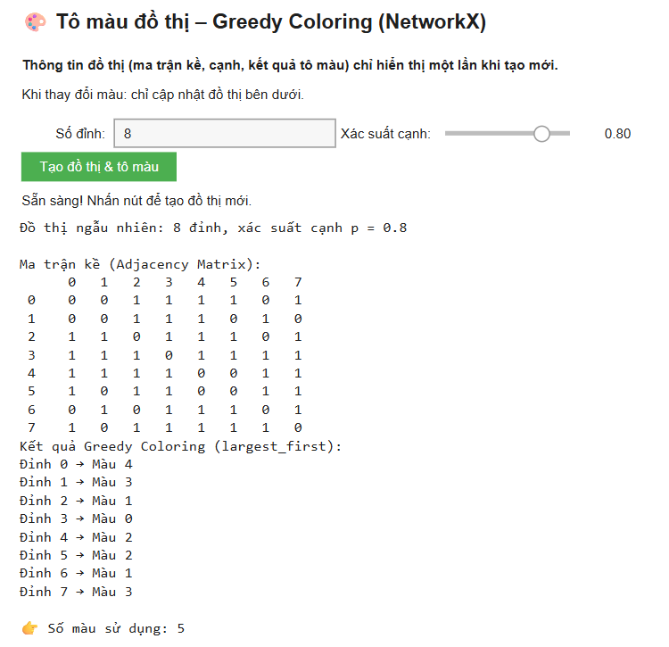
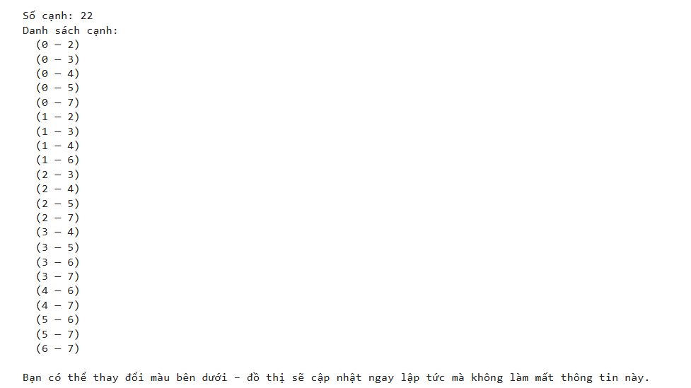
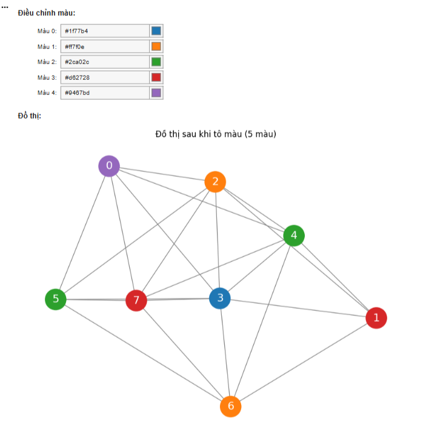

# 🎨 Tô màu đồ thị – Greedy Coloring (NetworkX)

Đây là một ứng dụng tương tác được xây dựng trong Google Colab, minh họa thuật toán Greedy Coloring (tô màu tham lam) cho đồ thị sử dụng thư viện `networkx` và cho phép người dùng tùy chỉnh màu sắc hiển thị bằng `ipywidgets` và `matplotlib`.

## 🚀 Cách chạy ứng dụng

1.  **Mở Notebook:** Mở file notebook này trong Google Colab.
2.  **Chạy các ô code đầu tiên:** Chạy lần lượt các ô code đầu tiên để ghi các file `graph_core.py`, `graph_helper.py`, và `main.py` vào môi trường Colab.
    *   `graph_core.py`: Chứa các hàm tạo đồ thị ngẫu nhiên và thực hiện thuật toán tô màu tham lam.
    *   `graph_helper.py`: Chứa các hàm hỗ trợ vẽ đồ thị, in ma trận kề và thông tin tô màu.
    *   `main.py`: Chứa logic chính của ứng dụng, xử lý tương tác người dùng với `ipywidgets`.
3.  **Chạy ô `main.py`:** Chạy ô cuối cùng có nội dung `%run main.py`. Thao tác này sẽ khởi động ứng dụng tương tác.

## 🎯 Tính năng

*   **Tạo đồ thị ngẫu nhiên:** Người dùng có thể chỉ định số lượng đỉnh (`n`) và xác suất tồn tại cạnh (`p`) để tạo một đồ thị ngẫu nhiên Erdos-Renyi.
*   **Thuật toán Greedy Coloring:** Ứng dụng sử dụng thuật toán tô màu tham lam với chiến lược 'largest_first' (tô màu đỉnh có bậc lớn nhất trước) để gán màu cho các đỉnh.
*   **Ma trận kề và thông tin tô màu:** Hiển thị ma trận kề của đồ thị và chi tiết kết quả tô màu (đỉnh → màu) cùng với tổng số màu được sử dụng.
*   **Tùy chỉnh màu sắc:** Người dùng có thể thay đổi màu sắc hiển thị cho từng 

 đã gán trong kết quả tô màu thông qua các `ColorPicker` tương tác. Đồ thị sẽ được cập nhật ngay lập tức mà không cần chạy lại thuật toán tô màu.
*   **Layout đồ thị cố định:** Sử dụng `nx.spring_layout` với một `seed` cố định để đảm bảo vị trí các đỉnh không thay đổi khi đồ thị được vẽ lại.

## 🛠️ Cấu trúc dự án

*   `graph_core.py`: Chứa các hàm cốt lõi liên quan đến lý thuyết đồ thị và thuật toán.
*   `graph_helper.py`: Chứa các hàm tiện ích để hiển thị và tính toán layout.
*   `main.py`: Chứa logic giao diện người dùng (UI) và điều phối các thành phần khác.

## 👨‍💻 Thư viện sử dụng

*   `networkx`: Để tạo, thao tác và tô màu đồ thị.
*   `matplotlib`: Để vẽ đồ thị.
*   `ipywidgets`: Để tạo giao diện người dùng tương tác trong Jupyter/Colab.

## Kết quả

